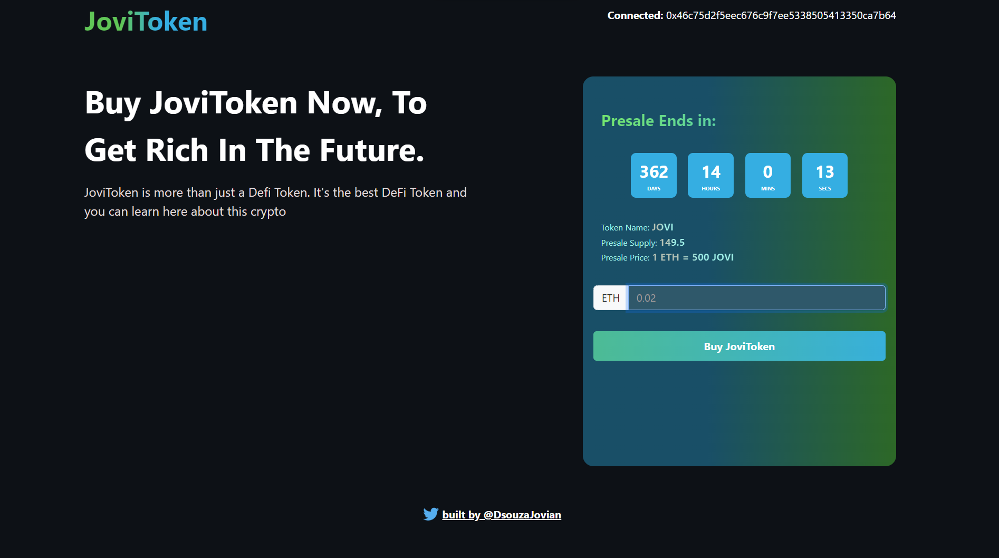

## JoviToken ICO Website

<!-- PROJECT LOGO -->
 

  

  <h3 align="center">JoviToken</h3>

  

    Checkout my new JoviToken built with Ethereum blockchain!
     
    <a href="https://jovitokenico.joviandsouza.repl.co/">View Demo</a>
    ·
    <a href="https://github.com/Jovian-Dsouza/JoviTokenICO/issues">Report Bug</a>
    ·
    <a href="https://github.com/Jovian-Dsouza/JoviTokenICO/issues">Request Feature</a>
  

<!-- ABOUT THE PROJECT -->
## About The Project

JoviToken is an ERC20 based token currently deployed on the Ethereum Goerli testnetwork. This token is for learning purposes only. ERC-20 is the technical standard for fungible tokens created using the Ethereum blockchain. A fungible token is one that is interchangeable with another token. This repo includes the website for the Presale and Initial Coin Offering (ICO) for JoviToken. 

For Smart Contract implementation follow [JoviTokenIco-contracts](https://github.com/Jovian-Dsouza/JoviTokenIco-contracts)

Here are some cool features of this crowdsale:

* Minted Crowdsale : Instead of having  a fixed supply the tokens are minted according to the total purchase
* Capped Crowdsale : adds a cap to your crowdsale, invalidating any purchases that would exceed that cap
* Individually Capped Crowdsale : Caps an individual's contributions
* Timed Crowdale : Allows buying of token in a certain time interval only
* Refundable Crowdale : Refunds the buyer if the Goal is not reached
* Token Time Vesting and Token Distribution
* Testcases to make sure that the smart contract is working correctly

(<a href="#readme-top">back to top</a>)

### Built With

* React
* Bootstrap
* Ether.js

(<a href="#readme-top">back to top</a>)

<!-- CONTRIBUTING -->
## Contributing

Contributions are what make the open source community such an amazing place to learn, inspire, and create. Any contributions you make are **greatly appreciated**.

If you have a suggestion that would make this better, please fork the repo and create a pull request. You can also simply open an issue with the tag "enhancement".
Don't forget to give the project a star! Thanks again!

1. Fork the Project
2. Create your Feature Branch (`git checkout -b feature/AmazingFeature`)
3. Commit your Changes (`git commit -m 'Add some AmazingFeature'`)
4. Push to the Branch (`git push origin feature/AmazingFeature`)
5. Open a Pull Request

(<a href="#readme-top">back to top</a>)

<!-- LICENSE -->
## License

Distributed under the MIT License.

(<a href="#readme-top">back to top</a>)

<!-- CONTACT -->
## Contact

Your Name - [@DsouzaJovian](https://twitter.com/DsouzaJovian) - dsouzajovian123@gmail.com

Project Link: [https://github.com/Jovian-Dsouza/JoviTokenICO](https://github.com/Jovian-Dsouza/JoviTokenICO)

(<a href="#readme-top">back to top</a>)

